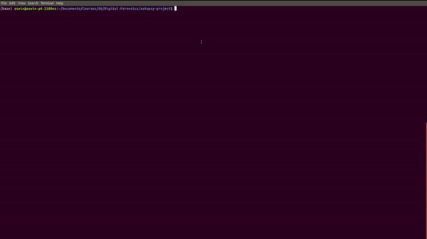

## An autopsy project that includes imaging a usb drive and retrieving a report from the drive



## Imaging the USB drive

```bash

sudo ./dcfldd-1.3.4-1/dcfldd if=/dev/sdc1 of=./images/usb-image.dd conv=noerror,sync bs=4096

```

## Installing dcfldd

```bash

wget http://prdownloads.sourceforge.net/dcfldd/dcfldd-1.3.4-1.tar.gz?download

```

## Opening autopsy

```bash

# autopsy shell
wget https://github.com/sleuthkit/autopsy/releases/download/autopsy-4.14.0/autopsy-4.14.0.zip

# java sleuthkit 
wget https://github.com/sleuthkit/sleuthkit/releases/download/sleuthkit-4.8.0/sleuthkit-java_4.8.0-1_amd64.deb

```

## Installing autopsy

#### More instructions

[https://github.com/sleuthkit/autopsy/blob/develop/Running_Linux_OSX.txt](https://github.com/sleuthkit/autopsy/blob/develop/Running_Linux_OSX.txt)

```bash

sudo apt-get install openjdk-8-jre

```

```bash

cd autopsy-4.14.0/ && source ./unix_setup.sh && cd $PWD

cd autopsy-4.14.0/ && bin/autopsy

```